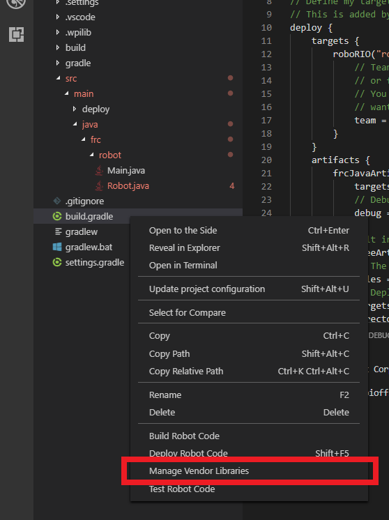

# Phoenix Installation Instructions - FRC BETA 2019

## 1) Install Phoenix on your PC
### Windows
For Windows, run the latest Windows EXE found on TeamForge.  
This will look very similar to previous installers - make sure you have the relevent component selected for your programming language.

### Linux
For Linux users, unzip the Linux zip found on TeamForge into USERHOME\frc2019.

## 2) Open Your Robot Program in VsCode
Either create or open an existing robot project in vscode.  Follow the WPI Screensteps instructions on how to do this.

## 3) Add Phoenix to Your Robot Project
This has a couple steps to it:
### A) Right-Click on "build.gradle" in the project tree, then select "Manage Vendor Libraries".

### B) At the top of your screen, a menu will appear.  Select "Install new libraries (offline)".

### C) The menu will now display a list of vendor libraries you can install.  Check "CTRE Phoenix", then click "OK"

## You will now be able to use CTRE Phoenix libraries in your robot project!

------------------------------------

# NEW: CTRE Phoenix Diagnostics
## This is the replacement for the CAN-plugin in the Web-Based Configuration Tool.

### More Documentation Coming Soon!