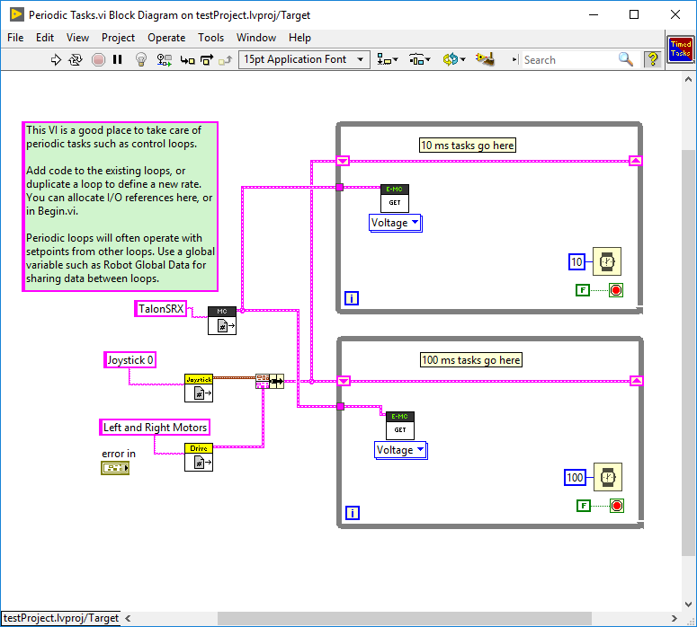

# LabVIEW Deploy Issue
There has been an issue reported where an attempt to deploy LabVIEW code results in a perpetual "Waiting for Target to Respond" state.

## In Short:

We've been able to reproduce the issue where the deploy process is perpetually waiting for a response from the target.  Ultimately the cause appears to be a limitation/vulnerability in the way LabVIEW loads binary libraries and executes the function calls.  This issue appears to be worked around with some of the changes we had already made for 5.3.1, so our recommendation for preventing the issue is to update to the latest Phoenix version.

## Details:

The issue is reproduceable under the following conditions:

1. The VIs are set to the (default) configuration of running in the LabVIEW UI Thread.  This setting is necessary for VIs calling non-reentrant functions (Phoenix CCI in version 5.2.2 and earlier is non-reentrant).
2. The VIs are being called in parallel in multiple loops.  eg. Functions in the same library being called in two different loops within Periodic Tasks.
3. The functions being called take some non-zero amount of time to execute and return.

The libraries in Phoenix (prior to 5.3) meet all of the above criteria.  

We also created a 'stub' version of a library that does nothing - all of the function calls were empty except for a short sleep to simulate execution time.  We were still able to reproduce the issue using the stub library, which indicates that any library will be affected if it meets the listed criteria.

## Reproducing the Issue:

If you're interested in reproducing the issue, steps are below.  You do not need CAN hardware to reproduce.
You can use any non-reentrant library to reproduce, but for ease of reproducing I'm assuming you have Phoenix 5.2.2 or less installed on your PC and roboRIO.

[1] Make a default LabVIEW robot program.  
[2] Open a single Talon SRX in Begin.vi  
[3] In PeriodicTasks.vi, call any get function in BOTH of the two default loops.  They do need to be the same function.  In this example I used get voltage:  
  

[4] Build the FRC Robot Boot-up Deployment.  
[5] Run the boot-up deployment as startup.  
[6] Run the boot-up deployment as startup again.  

At this point, the second run-as-startup should indefinetely pause while waiting for a response from target.

## The Workaround:

Fortunately, as an efficiancy/performance improvement for 5.3 we updated the binary file and LabVIEW VIs to suppport reentrancy.  This means that all of the binary functions are reentrant and all of the function calls in our VIs are set to run in any thread, not the UI thread.

When using 5.3.1, the issue is not reproduceable using the same steps above.

At this point, our recommendation is for any team seeing this issue while using Phoenix to update to 5.3.1.0.

When you update to 5.3.1.0, be sure to:  
[A] Re-run the LifeBoat process to install Phoenix/Web-Config onto the roboRIO  
[B] **Clean** and then Build your project, then re-run as startup.  
